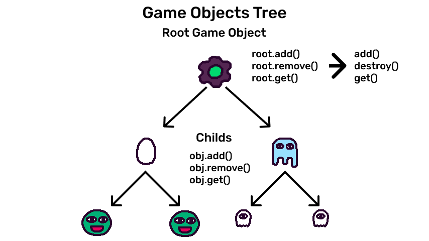

# Game Objects

Game objects are the lower unit of KAPLAY. They are the actors of your game, the
entities that move, interact, and make the game interesting. On this guide:

-   [`add()`](/doc/ctx/add) and [`make()`](/doc/ctx/make) functions to create
    game objects
-   [`GameObjRaw`](/doc/GameObjRaw) methods to manipulate game objects
-   Child game objects and the root game object
-   Object makers to create game objects with a specific set of components

## Creating Game Objects

The first way to create game objects is the `make()` function: It assembles a
game object from a list of components, but without attaching it to the scene.
For that, we use the `add()` function.

```js
const bullet = make([rect(6, 18), pos(80, 80)]);

add(bullet);
```

In the other hand, we have the `add()` function. This function creates a game
object and attaches it to the scene.

```js
const player = add([rect(32, 32), pos(80, 80)]);
```

Both operations create a game object with their respective components. Also,
even an object without a component has some methods and properties, this
interface is called the `GameObjRaw`.

## Child Game Objects and the Root Game Object

A game object can have child game objects. This is useful to create complex game
objects with multiple parts. We use the `GameObjRaw.add()` method to add a child
game object.

```js
const player = add([rect(32, 32), pos(80, 80)]);

const head = player.add([circle(16), pos(0, -16)]);

const gun = player.add([sprite("gun"), pos(0, 16)]);
```

Something you should know is that **every game object** is a child of the **root
game object**. The root game object is the game object that contains all the
game objects in the scene. That's why the `add()` function is, in fact, a
`GameObjRaw.add()` method.



## Game Object operations

There's a lot of operations that you can do with game objects. There's a list of
common operations:

-   [`destroy(obj)`](/doc/ctx/destroy) Destroy a game object
-   [`get(tag)`](/doc/GameObjRaw#get) Get a game object by its tag
-   [`GameObjRaw.destroy()`](/doc/GameObjRaw#destroy): Destroy the game object
    itself
-   [`GameObjRaw.get()`](/doc/GameObjRaw#get): Get a child game object by its
    tag, or all using `obj.get("*")`
-   [`GameObjRaw.children`](/doc/GameObjRaw#children): Get an array with all
    children game objects
-   [`GameObjRaw.is()`](/doc/GameObjRaw#is): Check if a game object has a
    tag/component

You can see the full list of operations in the [`GameObjRaw`](/doc/GameObjRaw)
documentation.

## Creating game object dynamically

There's 2 used ways to create **game objects dynamically**. The first one is a
function that returns a list of components. This is useful to create game
objects on-demand.

```js
function createBullet() {
    return [rect(6, 18), pos(80, 80), color(0.5, 0.5, 1)];
}

const b1 = add(createBullet());
```

The second way is to use **object makers**. Object makers are **factory
functions** that return a game object with `make()`. Is great for create game
objects and manipulate them later, before attaching them to the scene.

```js
function createBullet(spr) {
    const obj = make([pos(80, 80), color(0.5, 0.5, 1)]);

    if (spr) {
        obj.use(sprite(spr));
    } else {
        obj.use(rect(6, 18));
    }

    return obj;
}

const b1 = add(createBullet("bullet"));
const b2 = add(createBullet());
```
